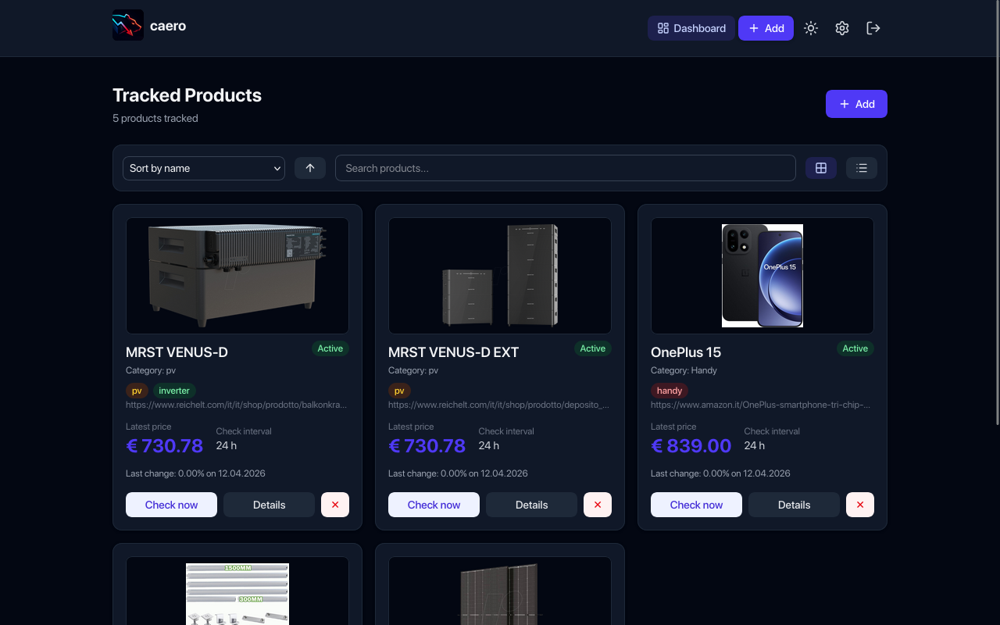

#  caero

zero price tracker

  

## Features

- Product tracking with:
  - URL + CSS selector based price extraction
  - optional category, memo, tags, and product image
  - per-product check interval and enable/disable toggle
- Product detail page with:
  - current price, all-time low, and last change summary
  - historical price chart
  - statistics (average/current/lowest/highest/total change/data points)
- Alerts:
  - conditions: below threshold, lowered, changed, any change
  - channels: email and Telegram
  - per-alert activate/deactivate, edit, and delete

## Run with Docker (recommended)

1. Copy environment file:
   - `cp .env.example .env`
2. Start the app:
   - `docker compose up --build`
3. Open:
   - `http://localhost:8000`

## Run locally (development)

### Backend

1. Copy environment file:
   - `cp .env.example .env`
2. Install dependencies:
   - `cd backend`
   - `uv sync`
3. Install Playwright browser:
   - `uv run playwright install chromium --with-deps`
4. Start API server:
   - `uv run fastapi run app/main.py --host 0.0.0.0 --port 8000`

### Frontend (dev server)

1. Install dependencies:
   - `cd frontend`
   - `npm ci`
2. Start Vite dev server:
   - `npm run dev`
3. Open:
   - `http://localhost:5173`

The frontend proxies `/api` requests to `http://localhost:8000` in development.
