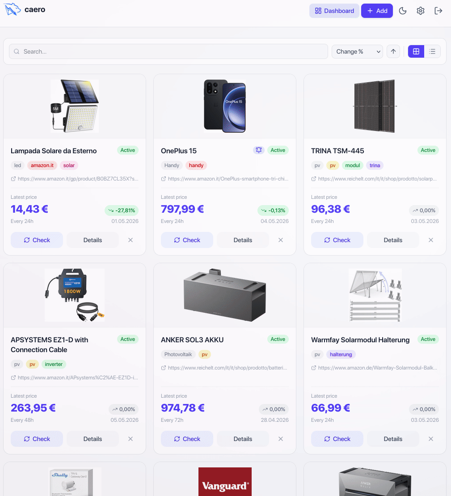

#  caero

<br>
<center><strong>Caero (zero), a self-hosted price tracker to help you catch the best deals.</strong></center>
<br>
<br>

<p align="center">
  
</p>

## Features

- **Track Anything** – Works on any website using URL + CSS selectors.
- **Smart Insights** – View historical price charts, all-time lows, and average costs.
- **Instant Alerts** – Get notified via **Telegram** or **Email** the moment a price changes.

---

## Quick Start (Docker)

The fastest way to get started is with Docker.

1.  **Set up your settings:**
    ```bash
    cp .env.example .env
    ```
2.  **Launch the app:**
    ```bash
    docker compose up -d
    ```
3.  **Start tracking:**
    Open [http://localhost:8000](http://localhost:8000) in your browser.

_Pull the latest image directly:_ `docker pull ghcr.io/13/caero:latest`

---

## How to Track a Product

Don't let "CSS Selectors" scare you—it's just a way to point **caero** to the price.

1.  **Find the Price:** Go to your product page (e.g., Amazon, BestBuy).
2.  **Copy the Path:** Right-click the price on the page → **Inspect**. In the window that opens, right-click the highlighted code → **Copy** → **Copy selector**.
3.  **Paste & Save:** Paste that into **caero** along with the URL.
